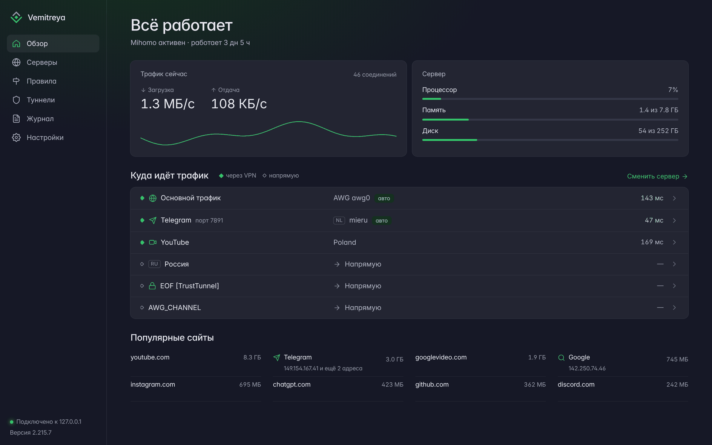
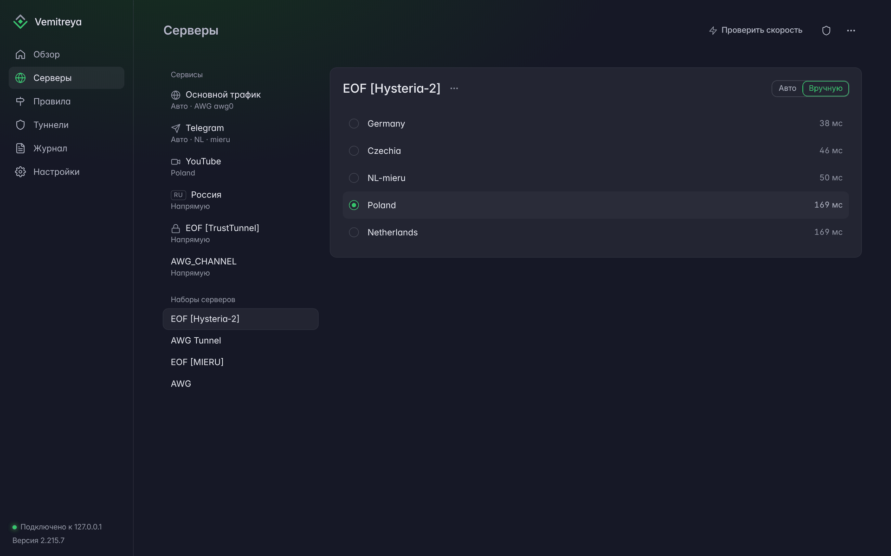
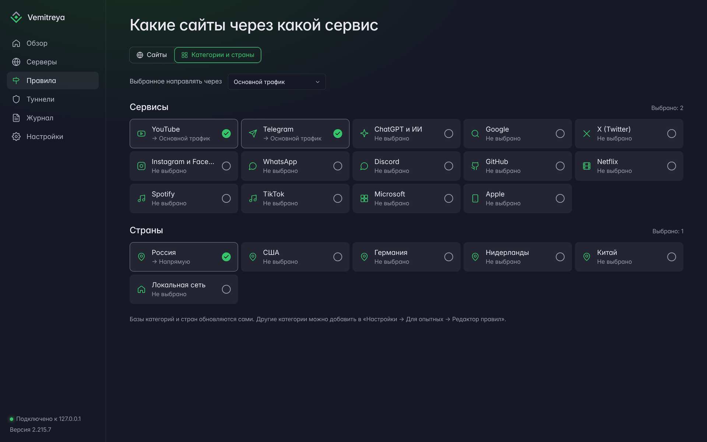
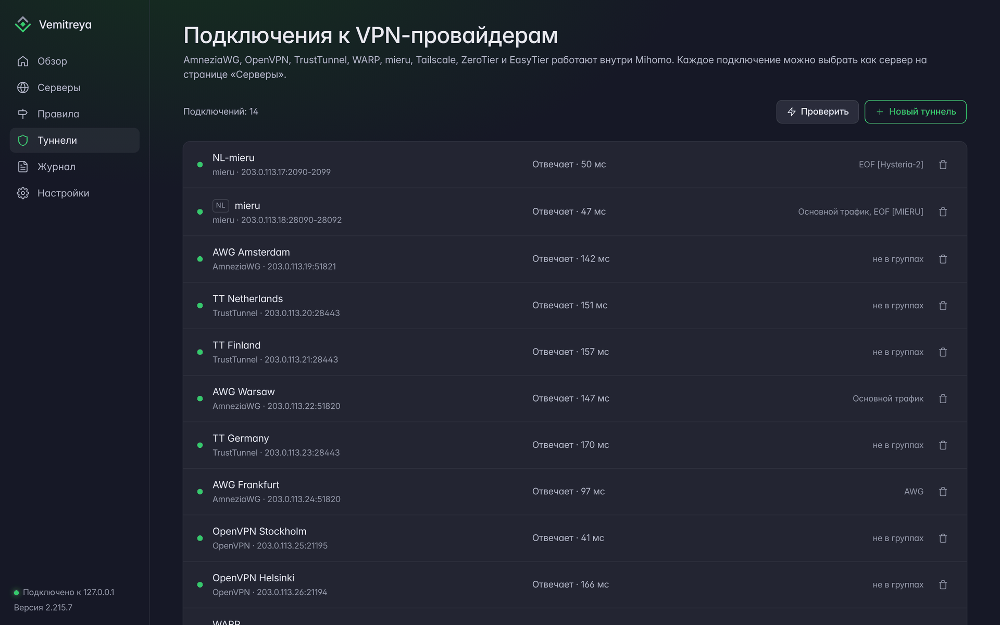
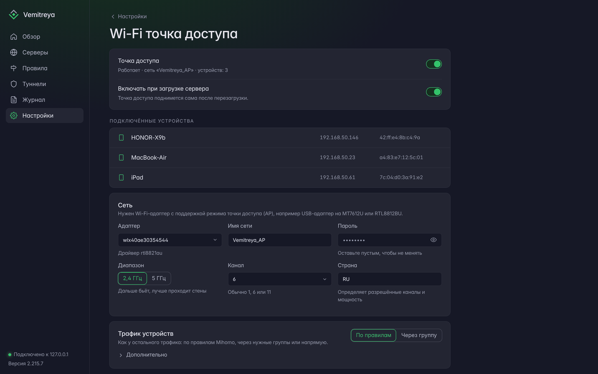
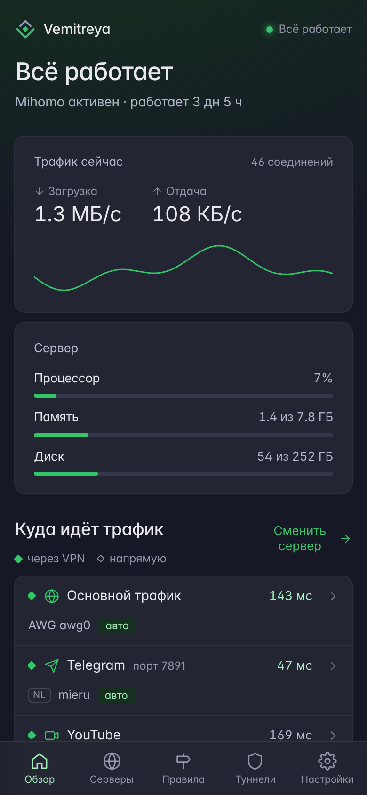
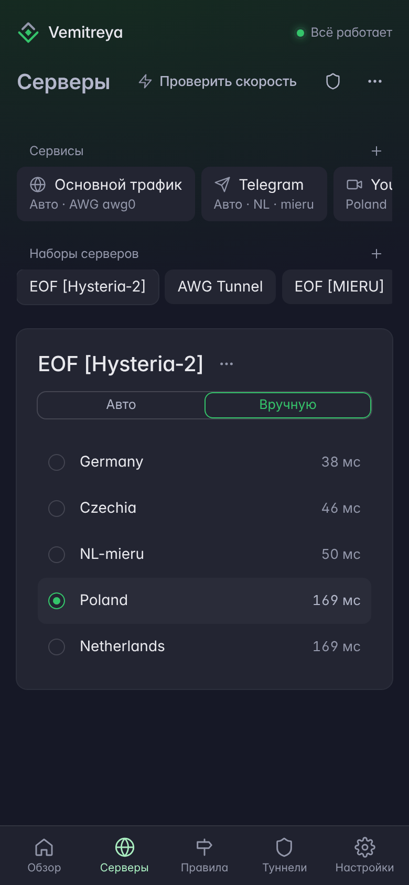
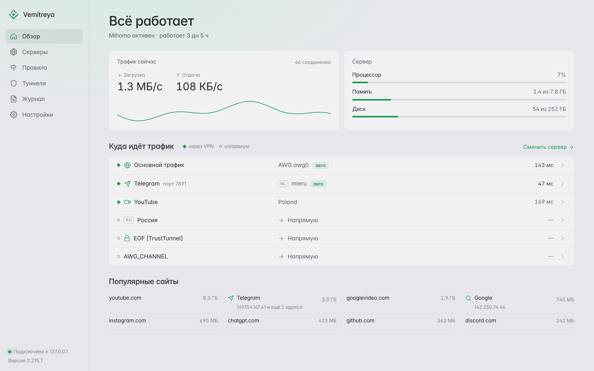

<p align="center">
  
</p>

<h1 align="center">Vemitreya</h1>

<p align="center">
  <b>Веб-панель для домашнего VPN-шлюза на базе <a href="https://github.com/MetaCubeX/mihomo">Mihomo</a></b><br>
  Какой сервис через какой сервер идёт — в одном понятном интерфейсе, с компьютера и с телефона.
</p>

<p align="center">
  
  
  
</p>

<p align="center">
  <a href="#установка"><b>Установка</b></a> ·
  <a href="https://github.com/vyalu/vemitreya/releases/latest"><b>Скачать последний релиз</b></a> ·
  <a href="docs/CHANGELOG.md">Что нового</a>
</p>

<p align="center">
  
</p>

---

## Что умеет

<p align="center"></p>

**Обзор.** Одной строкой — всё ли работает. Текущий трафик, нагрузка на сервер, через какой сервер сейчас идёт каждый сервис и пинг до него. «Популярные сайты» с подписями: IP-адреса подписаны сервисом (Telegram, Google, Meta…) или страной.

**Серверы.** Для каждого сервиса — свой сервер: вручную или автоматически (панель сама проверяет серверы и держит быстрейший). Автовыбор можно попросить не выбирать серверы определённых стран или со словом в имени. Состав групп меняется прямо здесь перетаскиванием, любое изменение отменяется кнопкой «Вернуть».

<p align="center"></p>

**Правила.** Сайт добавляется одной строкой — тип (домен, IP, страна) определяется сам. Популярные сервисы и страны — плитками: YouTube, Telegram, ChatGPT, Instagram, «Россия напрямую» и другие в одно нажатие. Для опытных — полный редактор правил Mihomo.

<p align="center"></p>

**Туннели.** VPN-подключения работают внутри Mihomo — без системных интерфейсов, служб и маршрутов. Вставьте конфиг провайдера, и подключение появится в списке серверов:

- **AmneziaWG** 1.0–3 и WireGuard
- **OpenVPN** — `.ovpn` от провайдера, UDP и TCP
- **TrustTunnel** и **mieru**
- **MASQUE** (Cloudflare WARP)
- **Tailscale** (в том числе Headscale), **ZeroTier**, **EasyTier**

Там же — серверы, добавленные вручную (VLESS, Shadowsocks, SOCKS5 и т. п.), а подписки (proxy-providers) подключаются в настройках.

<p align="center"></p>

**Wi-Fi точка доступа.** Сервер с USB-адаптером Wi-Fi раздаёт собственную сеть: трафик подключённых устройств идёт через Mihomo — по правилам или целиком через выбранную группу. Видно, кто подключён (имя, IP, MAC).

<p align="center"></p>

**Ещё:**

- **Роутеры** — мастер настройки MikroTik (RouterOS 6/7) и Keenetic, списки сайтов для роутера.
- **Сервисы и DNS** — службы, порты Mihomo, определение сайтов по соединению (sniffer), DNS-сервер Mihomo.
- **Обновления** — панель, Mihomo и гео-базы из GitHub-релизов или из архива.
- **Telegram** — уведомления о сбоях и восстановлении.
- **Оформление** — тёмная и светлая темы, пять цветовых акцентов, интерфейс увеличивается на экранах 2K и 4K.

### На телефоне

<p align="center">
  
  &nbsp;&nbsp;
  
</p>

### Светлая тема

<p align="center"></p>

<sub>На скриншотах демонстрационные данные.</sub>

---

## Требования

- Ubuntu 22.04 или 24.04 (чистый сервер или VPS)
- Root-доступ (`sudo`)
- Открытый порт `8888` для веб-панели

---

## Установка

```bash
git clone https://github.com/vyalu/vemitreya.git
cd vemitreya
sudo ./install.sh
```

Установщик предложит варианты:

```
1) Полная установка (Mihomo + Vemitreya панель)  ← рекомендуется
2) Только Vemitreya панель (Mihomo уже установлен)
3) Обновить Vemitreya панель
```

AmneziaWG, TrustTunnel, OpenVPN и другие VPN отдельно ставить не нужно — они работают
внутри Mihomo и добавляются в веб-интерфейсе («Туннели → Новый туннель»).

После установки откройте `http://SERVER_IP:8888/`. API-токен будет показан в конце
установки и сохранён в `/opt/vemitreya/.env`. Посмотреть его позже: `sudo vemitreya-token`.

---

## Обновление

**Из релиза:** скачайте архив `vemitreya-X.Y.zip` со страницы
[Releases](https://github.com/vyalu/vemitreya/releases), затем:

```bash
unzip -o vemitreya-X.Y.zip
cd vemitreya
sudo ./update.sh
```

**Через git:**

```bash
cd vemitreya
git pull
sudo ./update.sh
```

После обновления откройте панель с очисткой кэша браузера (`Ctrl+Shift+R`).

**Через веб-интерфейс:** раздел «Обновления» → загрузить `.zip` архив, либо
кнопка «Обновить с GitHub» (если в `.env` задан `PANEL_GITHUB_REPO`).

---

## Архитектура

| Компонент | Технология |
|-----------|-----------|
| Backend | Python, FastAPI |
| Frontend | React (single-page, без сборки) |
| Хранилище | SQLite (статистика, настройки) |
| Прокси-ядро | Mihomo (внешний процесс) |

Панель не подменяет Mihomo, а управляет им через его REST API
(`external-controller`) и редактирует YAML-конфиг с сохранением комментариев.

| Путь | Назначение |
|------|------------|
| `/opt/vemitreya/` | Панель (backend + frontend) |
| `/opt/vemitreya/data/panel.db` | SQLite |
| `/opt/vemitreya/.env` | Конфигурация и API-токен |
| `/opt/mihomo/` | Mihomo core + конфиг |
| `/usr/local/lib/vemitreya/vemitreya-wifi` | Служебный скрипт точки доступа Wi-Fi |

Подробнее — в [docs/ARCHITECTURE.md](docs/ARCHITECTURE.md).

---

## Документация

- [Установка и развёртывание](docs/DEPLOYMENT.md)
- [Архитектура](docs/ARCHITECTURE.md)
- [API](docs/API.md)
- [Решение проблем](docs/TROUBLESHOOTING.md)
- [Настройка роутеров](docs/routers/) — MikroTik (RouterOS 6/7), Keenetic

---

## Управление сервисами

```bash
# Панель
sudo systemctl status vemitreya
sudo systemctl restart vemitreya
sudo journalctl -u vemitreya -f

# Mihomo
sudo systemctl restart mihomo

# Wi-Fi точка доступа
sudo systemctl status vemitreya-wifi
sudo journalctl -u vemitreya-wifi -n 50

# API-токен: показать / сменить
sudo vemitreya-token
sudo vemitreya-token rotate
```

---

## Поддержать проект

Если панель оказалась полезной, можно поддержать разработку:

[](https://yoomoney.ru/to/4100116126044784)

---

## Лицензия

[MIT](LICENSE) — свободное использование, изменение и распространение, в том
числе в коммерческих целях, при сохранении текста лицензии.

Проект не аффилирован с Mihomo, AmneziaWG, MikroTik или Keenetic; использует их как
внешние компоненты.
